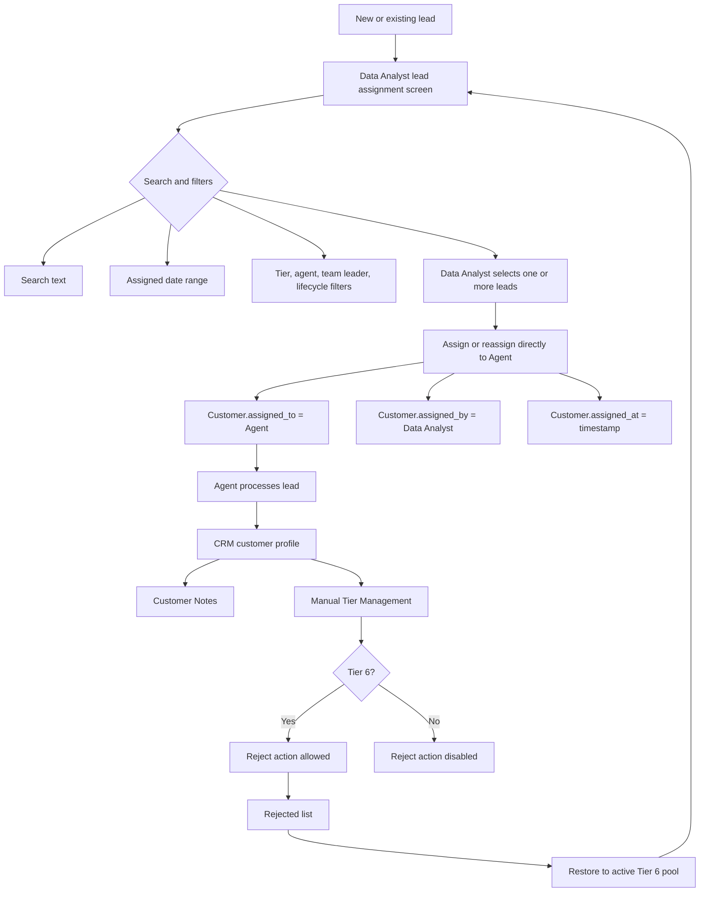
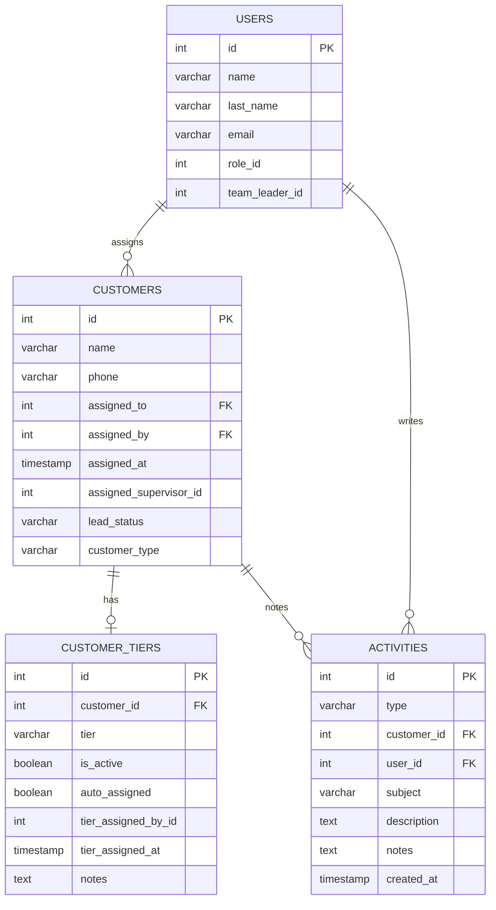

# CRM Data Analyst & Tier Restructure

## System Flowchart

## ERD

## Database Changes

- Add `customers.assigned_by` and `customers.assigned_at`.
- Add indexes for assignment owner/date filtering.
- Add `data-analyst` role and CRM permissions.
- Replace legacy `customer_tiers.tier` values with `tier_1` through `tier_6` plus `rejected`.
- Disable auto-tier semantics by forcing migrated tier rows to `auto_assigned = false`.
- Restore legacy rejected customers to active Tier 6 in the migration script.

## Breaking-Change Review

- Old frontend routes remain in place, but the backend also exposes `/crm/data-analyst/*`.
- Old `/crm/sales-manager/*` APIs remain as aliases for compatibility.
- Team Leader assignment endpoints now reject requests from `sales-team-leader` role users.
- Legacy tier values are migrated; integrations sending `silver/gold/vip` must switch to `tier_1` through `tier_6`.
- Rejection requires the customer's current saved tier to be `tier_6`.
